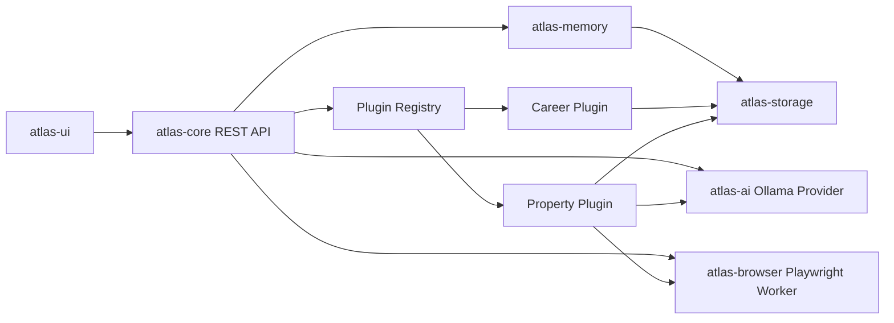

# Atlas AI

Atlas AI is a local-first desktop AI platform scaffolded as a modular Spring Boot and React application.

It is intentionally single-user, local, and plugin-oriented. The core platform owns settings, model access, prompt management, memory, storage, project indexing, and plugin loading. Career Copilot is the primary plugin; Property Copilot remains available as a secondary plugin.

## Modules

- `atlas-core`: Spring Boot app, plugin registry, REST API, settings, prompt and playground endpoints.
- `atlas-common`: small shared utilities.
- `atlas-plugin-api`: stable plugin SPI used by core and every plugin.
- `atlas-prompts`: prompt file loading.
- `atlas-settings`: typed settings records.
- `atlas-ai`: Ollama-backed model provider abstraction.
- `atlas-browser`: reusable Browser Use / Playwright automation boundary.
- `atlas-memory`: project memory service.
- `atlas-storage`: local workspace folders plus SQLite project index.
- `atlas-ui`: React, TypeScript, Vite, Tailwind interface.
- `plugins/career-plugin`: career assistant for companies, jobs, visa scoring, match scoring, and applications.
- `plugins/property-plugin`: property workflow for public listing analysis.
- `career-intelligence`: orchestrates intelligence services before recommendations are made.
- `company-intelligence`: company profile and historical signal model.
- `visa-intelligence`: sponsorship risk analysis with confidence and evidence.
- `job-ranking`: job scoring and duplicate detection.
- `recommendation-engine`: apply/skip/review recommendation categories.
- `resume-intelligence`: resume health and ATS keyword analysis.
- `daily-briefing`: morning dashboard aggregation.
- `career-learning`: application outcome statistics.

Career Copilot can now prepare local application review packages containing conservative resume drafts, cover letter drafts, reusable answer drafts, and a review report. Browser automation remains intentionally gated behind explicit user approval.

## Architecture



## Local Run

See [INSTALL.md](INSTALL.md).

Backend:

```bash
./gradlew :atlas-core:bootRun
```

Frontend:

```bash
cd atlas-ui
npm install
npm run dev
```

## API

OpenAPI UI is available at `http://localhost:8080/swagger-ui/index.html` when the backend is running.
