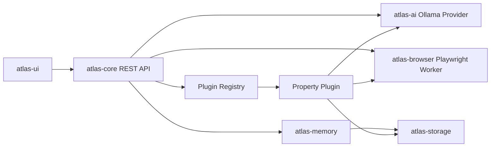

# Atlas AI

Atlas AI is a local-first desktop AI platform scaffolded as a modular Spring Boot and React application.

It is intentionally single-user, local, and plugin-oriented. The core platform owns settings, model access, prompt management, memory, storage, project indexing, and plugin loading. Plugins contribute workflows without becoming core dependencies.

## Modules

- `atlas-core`: Spring Boot app, plugin registry, REST API, settings, prompt and playground endpoints.
- `atlas-plugin-api`: stable plugin SPI used by core and every plugin.
- `atlas-ai`: Ollama-backed model provider abstraction.
- `atlas-browser`: reusable Browser Use / Playwright automation boundary.
- `atlas-memory`: project memory service.
- `atlas-storage`: local workspace folders plus SQLite project index.
- `atlas-ui`: React, TypeScript, Vite, Tailwind interface.
- `plugins/property-plugin`: first plugin workflow for public property listing analysis.

## Architecture

## Local Run

See [INSTALL.md](/Users/sdara/Documents/Codex/2026-06-27/atlas-ai-autonomous-development-prompt-you/INSTALL.md).

## API

OpenAPI UI is available at `http://localhost:8080/swagger-ui/index.html` when the backend is running.
