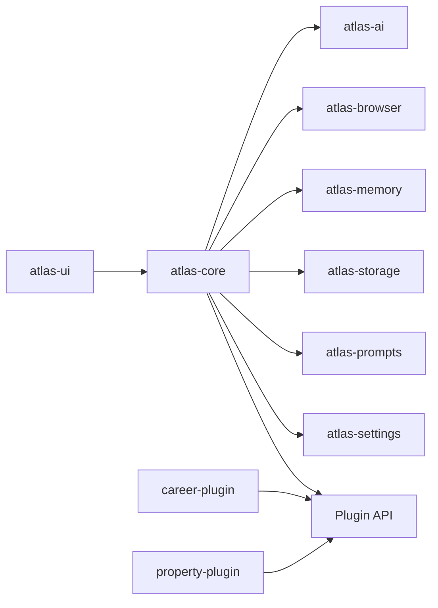

# Atlas AI Architecture

```mermaid
flowchart LR
  UI["atlas-ui"] --> Core["atlas-core"]
  Core --> AI["atlas-ai"]
  Core --> Browser["atlas-browser"]
  Core --> Memory["atlas-memory"]
  Core --> Storage["atlas-storage"]
  Core --> Prompts["atlas-prompts"]
  Core --> Settings["atlas-settings"]
  Core --> Plugins["Plugin API"]
  Career["career-plugin"] --> Plugins
  Property["property-plugin"] --> Plugins
```

Atlas is local-first and plugin-oriented. Career Copilot is now the primary product plugin; Property Copilot remains available as a secondary plugin.
