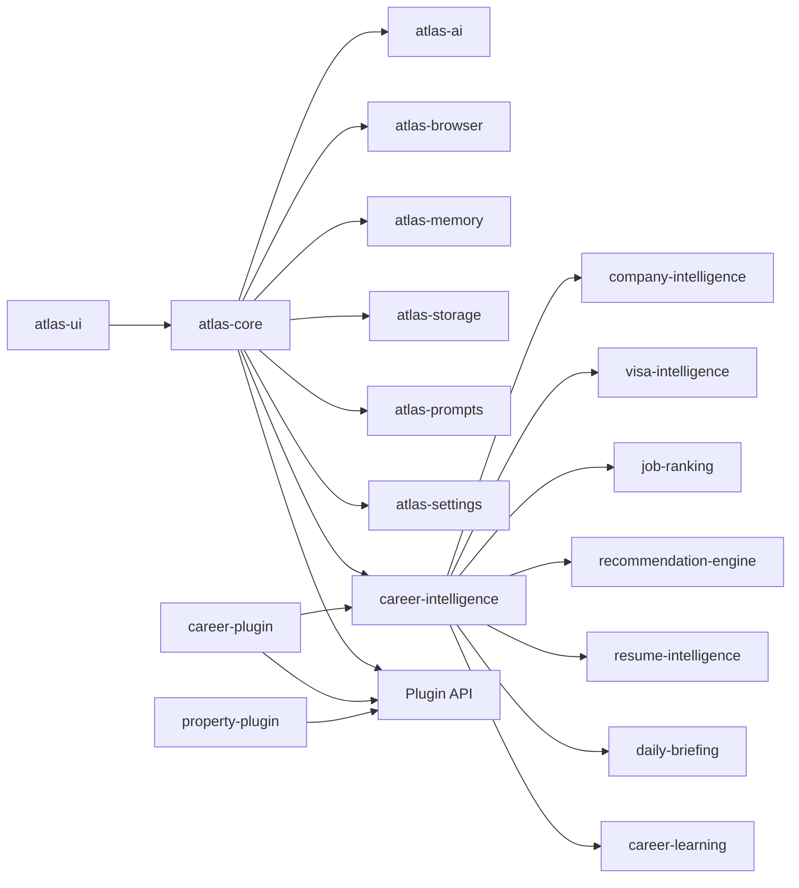

# Atlas AI Architecture

Atlas is local-first and plugin-oriented. Career Copilot is now the primary product plugin; Property Copilot remains available as a secondary plugin.

Career Intelligence is intentionally separate from browser automation. It scores, explains, ranks, and recommends before any future ATS workflow is allowed to act.
